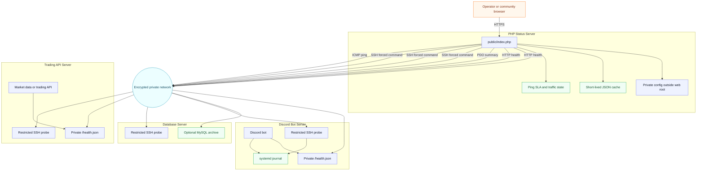

# Architecture

SignalOps Status is a small PHP application that renders a public status surface from private operational signals. It favors simple deployment and careful redaction over heavy metrics storage.

The frontend is rendered server-side by PHP. A small static JavaScript file handles the interactive latency map and the browser-local Light/Dark theme toggle; there is no build step or framework runtime.



## Data Flow

1. `public/index.php` loads config from `/etc/signalops-status/config.php`, `config/signalops.php`, or environment variables.
2. The collector reads cached status when possible.
3. Uncached collection gathers HTTP health, machine probes, optional MySQL summaries, ping SLA, private traffic counters, and latency links.
4. The dashboard renders sanitized labels, metrics, relative times, and private-network status.

## Edge Cache

SignalOps can emit CDN-friendly response headers when `cache.cdn.enabled` is true:

- `Cache-Control` with `public`, `s-maxage`, `stale-while-revalidate`, and `stale-if-error`
- `CDN-Cache-Control`
- `Cloudflare-CDN-Cache-Control`

Cloudflare still needs a Cache Rule that marks the HTML page eligible for cache. Match only the public status hostname and ignore query strings in the cache key unless query parameters intentionally change the rendered dashboard.

## Probe Contract

Remote probes return JSON:

```json
{
  "ok": true,
  "cpu_pct": 2.5,
  "iowait_pct": 0.0,
  "memory": {
    "total": 8589934592,
    "available": 6442450944,
    "used_pct": 25.0
  },
  "cpu": {
    "model": "Example CPU",
    "cores": 2
  },
  "network": {
    "iface": "tailscale0",
    "rx_bytes": 123,
    "tx_bytes": 456,
    "total_bytes": 579
  },
  "latencies": {
    "api": {
      "ok": true,
      "latency_ms": 8.2,
      "error": null
    }
  },
  "disks": [],
  "services": {},
  "journal": {
    "ok": true,
    "window": "24h",
    "warning_count": 0,
    "error_count": 0,
    "latest_at": null,
    "latest": []
  },
  "load": [0.01, 0.02, 0.03],
  "uptime_seconds": 123456,
  "error": null
}
```

## SLA Semantics

SLA is ping-based only. It is intentionally separate from:

- Discord bot health.
- API health.
- database availability.
- systemd service state.
- application-level freshness.

This lets a public page show the difference between network reachability and application degradation.

## Redaction Boundary

The repository contains only safe defaults and example placeholders. Production credentials, private hostnames, SSH keys, and real URLs belong in private config outside the web root.

Rendered output should include:

- service names;
- cities;
- status and freshness;
- sanitized journal summaries;
- resource and latency metrics.

Rendered output should not include:

- raw connection strings;
- tokens;
- real private IPs;
- passwords;
- raw stack traces;
- unrestricted log lines.
