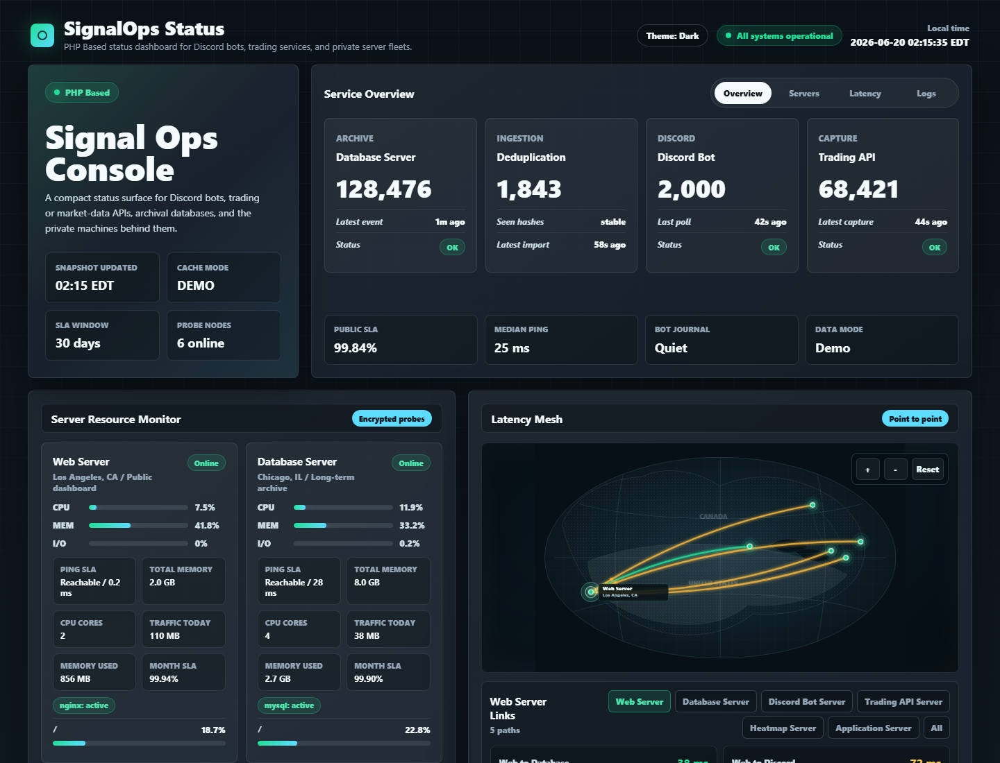

# SignalOps Status

**PHP Based status dashboard for Discord bots, trading services, and private server fleets.**

SignalOps Status is a self-hosted operations page for teams that run Discord alert bots, trading or market-data APIs, archival databases, and small private fleets. It is built with plain PHP, ships with a full demo mode, and can be dropped onto a normal PHP hosting panel without a JavaScript build step.



## Highlights

- **PHP Based**: no Node build pipeline, no frontend framework, no external SaaS dependency.
- Discord bot health cards from private `/health.json` endpoints.
- Sanitized Discord bot error journal from systemd/journald.
- CPU, memory, I/O wait, load, uptime, disk, services, and private-network traffic.
- Ping-only SLA, separate from service health.
- Interactive point-to-point latency map with clickable server nodes.
- Optional MySQL summary for archived trading signals or bot events.
- Demo mode is enabled by default, so the dashboard works immediately after clone.
- Redacts IPs, URLs, bearer tokens, bot tokens, long IDs, and common secret patterns before rendering.

## Good Fit

SignalOps Status is designed for:

- Discord trading alert bots.
- Options flow, market scanner, and signal delivery infrastructure.
- Small private networks on Tailscale, WireGuard, or a trusted LAN.
- Operators who want a public-facing status page without exposing private hosts or credentials.

It is not intended to be a full observability stack like Grafana, Prometheus, or Datadog. It is a polished status surface: fast to install, easy to read, and safe enough to put in front of a community.

## Quick Start

Run the demo locally:

```bash
php -S 127.0.0.1:8080 -t public
```

Open:

```text
http://127.0.0.1:8080
```

Demo mode is controlled by `app.demo`. The default is `true`.

## Production Install

Copy the example config outside the web root:

```bash
sudo install -d -m 0750 -o root -g www-data /etc/signalops-status
sudo install -m 0640 -o root -g www-data config/signalops.example.php /etc/signalops-status/config.php
sudo install -d -m 0750 -o www-data -g www-data /var/lib/signalops-status
```

Edit `/etc/signalops-status/config.php`:

```php
'app' => [
    'demo' => false,
],
```

Point your virtual host document root at `public/`. If your hosting panel points at the repository root, `index.php` forwards to `public/index.php`.

## Probe Model

SignalOps can monitor machines in three ways:

| Kind | Description |
| --- | --- |
| `local` | Reads `/proc`, disks, services, ping targets, and optional journal units on the web server. |
| `ssh` | Runs a short remote probe through SSH. Use a restricted SSH key or a forced command. |
| `endpoint` | Uses a machine payload returned by an HTTP health endpoint. |

The included probe template lives at:

```text
scripts/signalops-status-probe.py
```

Recommended authorized key style:

```text
command="/usr/local/bin/signalops-status-probe",no-agent-forwarding,no-X11-forwarding,no-port-forwarding,no-pty ssh-ed25519 AAAA...
```

Customize `DISKS`, `SERVICES`, `PING_TARGETS`, and `JOURNAL_UNITS` in the probe script for each host.

## Discord Error Journal

The Discord journal card reads warning/error entries from configured systemd units, then sanitizes each message before rendering it.

The page does not render raw logs. It redacts:

- URLs and private hosts.
- bearer tokens and Discord bot tokens.
- `password=`, `token=`, `secret=`, `key=`, and similar fields.
- long IDs and long random strings.

## Configuration

Use `config/signalops.example.php` as the production template. Keep real values outside the repository.

Important fields:

| Field | Purpose |
| --- | --- |
| `app.demo` | Set to `false` for production. |
| `cache.cdn.enabled` | Emit CDN-friendly headers for Cloudflare or another edge cache. |
| `endpoints.discord.url` | Private Discord bot `/health.json`. |
| `endpoints.api.url` | Private trading API `/health.json`. |
| `machines[].journal_units` | systemd units to summarize in the error journal. |
| `machines[].latency_targets` | Private hostnames/IPs for point-to-point latency. |
| `latency_map.nodes` | Display labels, cities, and fixed map coordinates. |
| `database.summary_sql` | Optional SQL for archive summary metrics. |
| `database.recent_sql` | Optional SQL for latest signals/events table. |

## Cloudflare CDN

SignalOps can sit behind Cloudflare, but Cloudflare does not cache HTML automatically. To make the public status page cacheable at the edge, enable CDN headers in private config:

```php
'cache' => [
    'cdn' => [
        'enabled' => true,
        'edge_max_age' => 60,
        'stale_while_revalidate' => 300,
        'stale_if_error' => 604800,
    ],
],
```

Then add a Cloudflare Cache Rule for only the status hostname:

- Cache eligibility: `Eligible for cache`
- Origin Cache Control: respect origin headers
- Cache key: ignore query string unless your deployment uses query parameters for different pages
- Keep authenticated or user-specific pages outside this rule

When enabled, SignalOps sends `Cache-Control`, `CDN-Cache-Control`, and `Cloudflare-CDN-Cache-Control` headers with short edge TTLs and stale-if-error protection.

See [docs/cloudflare-cache-rules.md](docs/cloudflare-cache-rules.md) for the full Cloudflare setup, including the exact Cache Rule and verification commands.

## Security Notes

- Do not commit `config/signalops.php`, `/etc/signalops-status/config.php`, SSH keys, tokens, hostnames, or generated state files.
- Use a read-only database account.
- Keep health endpoints on an encrypted private network.
- Prefer forced-command SSH keys for probes.
- Treat public status pages as marketing surfaces: show health, not secrets.

## Requirements

- PHP 8.1 or newer.
- Linux for resource probing.
- `ssh`, `ping`, and `systemctl` for machine probes.
- PDO MySQL only if you enable the optional database summary.

## Related Ideas

SignalOps Status works well beside:

- Discord bot repositories.
- Trading signal APIs.
- Options heatmap or scanner workers.
- Public Discord community landing pages.

## License

MIT
